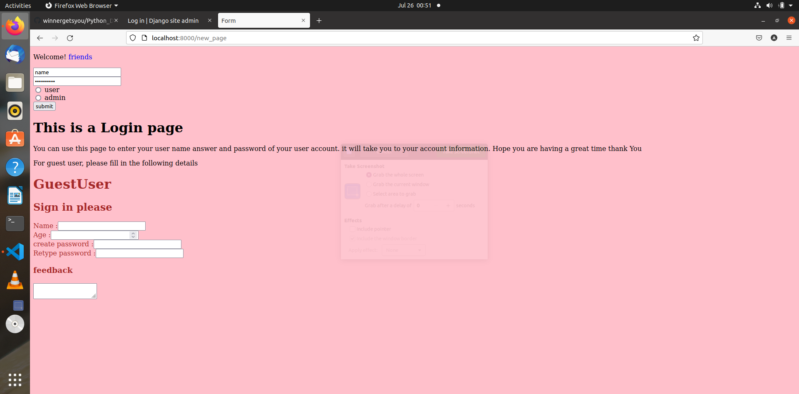

# Python_Django_Repos_Local_host
created my first host_local django project

***

# This is a Django Project 

> ## Inorder to execute this project in your local host , follow the steps below

1. Downlaod Django -- Note : use it in Virtual Environment 

2. Git clone this project in your django directory .. 

3. Python manage.py runserver

4. You will see the following result 

HTML - CSS codes executed in the Django Project 

